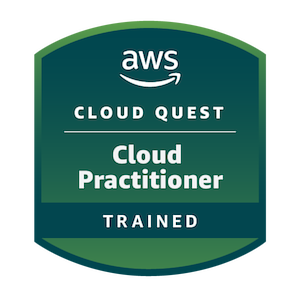
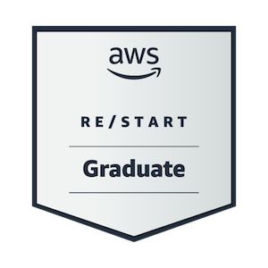

## Hi I'm Gian Yves 👋

I'm an AWS re/Start alumni from batch PHMAN28 exploring cloud computing and IT fundamentals. I’m documenting my learning journey here through small projects and practice lab.

## 🏆 Certifications & Badges

## 📫 How to reach me

- Email: giangarcia479@gmail.com  
- LinkedIn: [Gian Yves Garcia]([https://linkedin.com/in/yourprofile](https://www.linkedin.com/in/gian-yves-garcia-980b24309/))
<!--
**gianyves/gianyves** is a ✨ _special_ ✨ repository because its `README.md` (this file) appears on your GitHub profile.

Here are some ideas to get you started:

- 🔭 I’m currently working on ...
- 🌱 I’m currently learning ...
- 👯 I’m looking to collaborate on ...
- 🤔 I’m looking for help with ...
- 💬 Ask me about ...
- 📫 How to reach me: ...
- 😄 Pronouns: ...
- ⚡ Fun fact: ...
-->
